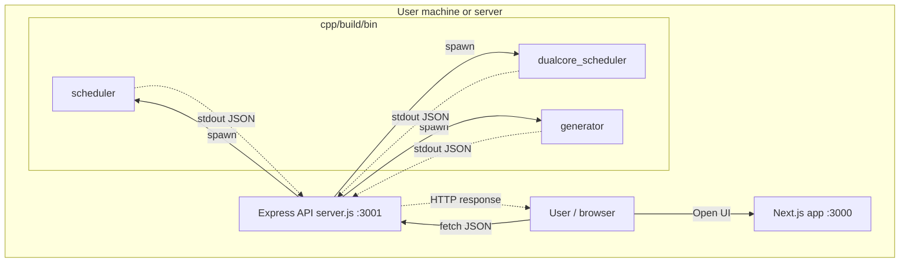
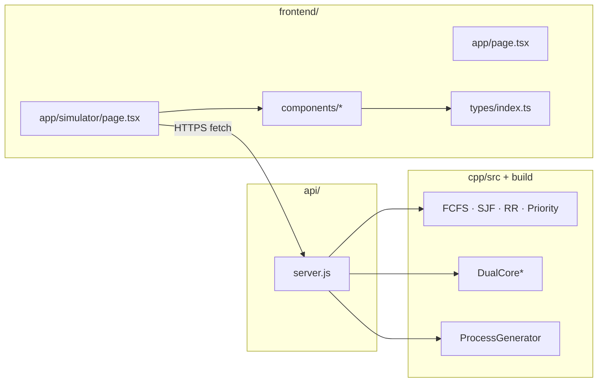
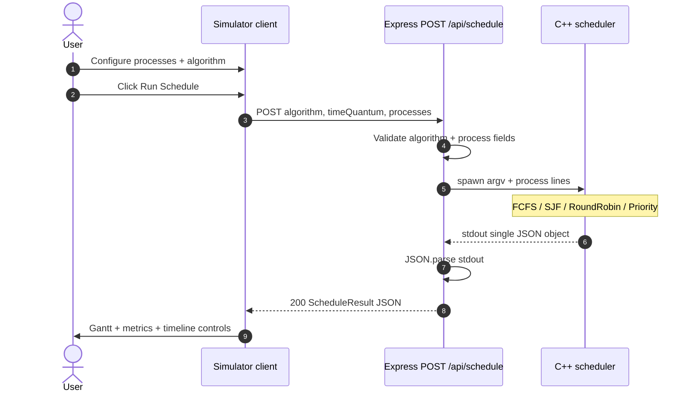
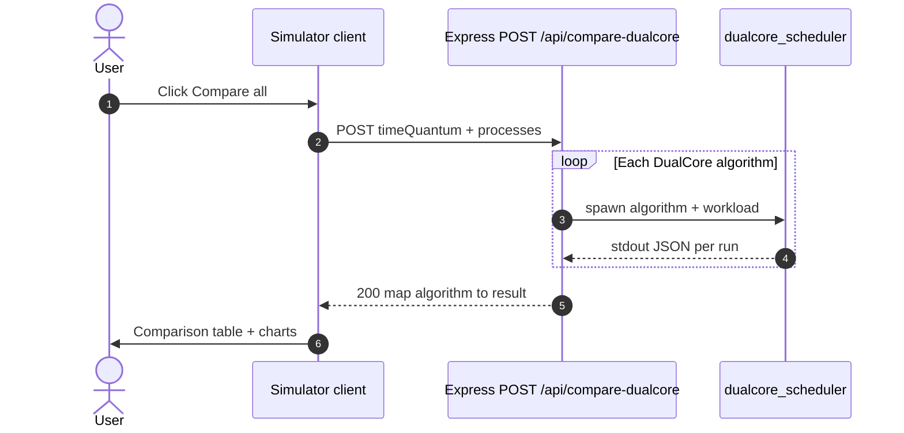
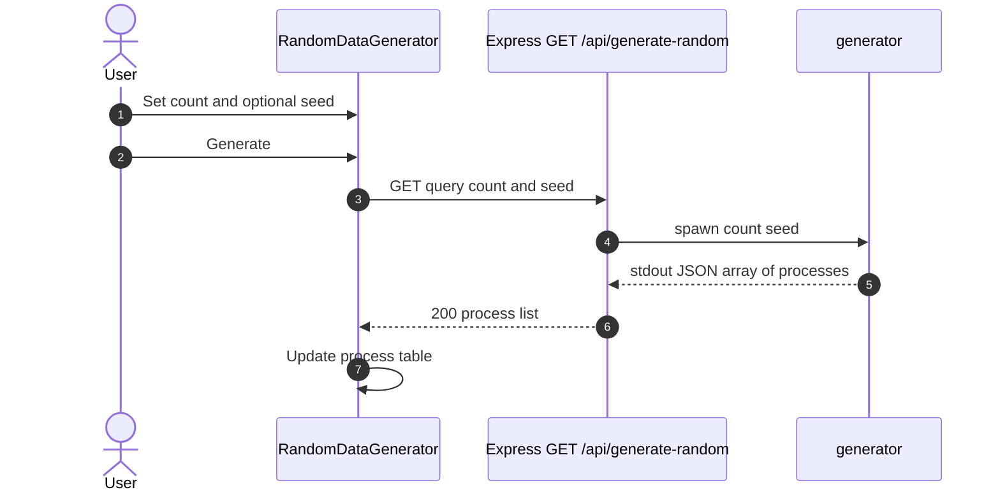
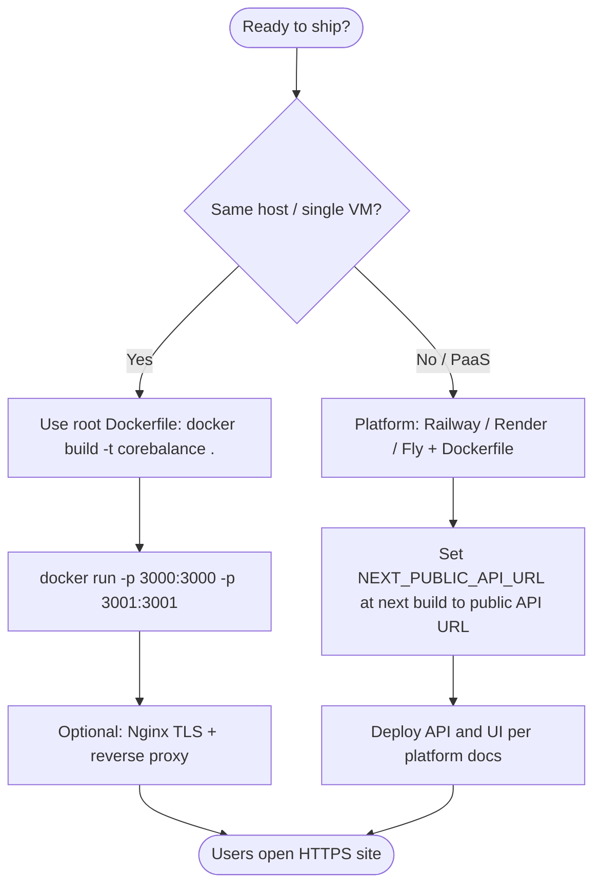

# CoreBalance — Advanced Multi-Core CPU Scheduling Simulator

**CoreBalance** is an educational **operating-systems** project: you define a workload (processes with arrival time, burst time, and optional priority / memory hints), pick **single-core** or **dual-core** scheduling modes, run **FCFS**, **SJF**, **Round Robin**, or **Priority** (and their dual-core variants), then inspect **Gantt timelines**, **averages**, **CPU utilization**, and **side-by-side comparison** — with a **Next.js** UI talking to a small **Express** API that delegates the real scheduling to **C++17** executables.

| Item | Details |
|------|---------|
| **License** | MIT (see `LICENSE`) |
| **Stack** | C++17 (core) · Node.js + Express (bridge) · Next.js 14 + React 18 + TypeScript + Tailwind CSS (UI) |
| **Repository** | [github.com/subhm2004/CoreBalance-Advanced-Multi-Core-Simulator](https://github.com/subhm2004/CoreBalance-Advanced-Multi-Core-Simulator) |

**Diagrams:** This README includes **Mermaid** blocks (architecture + sequences + deployment flow). They render automatically on **GitHub**; in VS Code / Cursor, use a Mermaid preview extension if needed.

---

## Table of contents

1. [What you get](#what-you-get)
2. [Architecture](#architecture)
   - [Mermaid: system context](#mermaid-system-context)
   - [Mermaid: component and deployment view](#mermaid-component-and-deployment-view)
   - [Mermaid: sequence run schedule single-core](#mermaid-sequence-run-schedule-single-core)
   - [Mermaid: sequence compare dual-core](#mermaid-sequence-compare-dual-core)
   - [Mermaid: sequence random generation](#mermaid-sequence-random-generation)
3. [Scheduling algorithms](#scheduling-algorithms)
4. [Repository layout](#repository-layout)
5. [Prerequisites](#prerequisites)
6. [Quick start (recommended)](#quick-start-recommended)
7. [Manual setup](#manual-setup)
8. [Running & URLs](#running--urls)
9. [Environment variables](#environment-variables)
10. [HTTP API reference](#http-api-reference)
11. [Frontend application](#frontend-application)
12. [Deployment](#deployment)
13. [Docker](#docker)
14. [Development notes](#development-notes)
15. [Troubleshooting](#troubleshooting)
16. [Security & privacy](#security--privacy)
17. [Contributing](#contributing)
18. [Further reading in this repo](#further-reading-in-this-repo)

---

## What you get

### Scheduling engine (C++)

- **Single-core** binary `scheduler`: FCFS, SJF, Round Robin, Priority — one CPU, strict simulation order from your algorithm choice.
- **Dual-core** binary `dualcore_scheduler`: `DualCoreFCFS`, `DualCoreSJF`, `DualCoreRoundRobin`, `DualCorePriority` — two parallel timelines (`core0` / `core1`) plus aggregate metrics (e.g. utilization, context switches where implemented).
- **Random process generator** binary `generator`: used by the API for `GET /api/generate-random` with optional **seed** for reproducible demos.

All schedulers communicate results as **JSON on stdout**; the Node API parses that JSON and forwards it to the browser.

### Web UI (Next.js)

- **Landing** (`/`) — project overview and navigation.
- **Simulator** (`/simulator`) — main lab:
  - Editable **process table** (arrival, burst, priority, optional memory field used in payloads).
  - **Algorithm** and **mode**: single-core run, dual-core run, or **compare all dual-core** algorithms on the same workload.
  - **Time quantum** for Round Robin (single and dual).
  - **Gantt** visualization (single or dual core), **metrics** tables, **CPU utilization** charting where data is returned, **comparison** table for multi-algorithm runs.
  - **Playback**: play/pause, speed, optional **step** mode over the timeline.
  - **Dark / light** theme (`next-themes`).
  - **Random data** panel calling the generator API.

### API bridge (Express)

- Validates bodies, spawns the correct binary with **algorithm name**, **time quantum**, and a **line-oriented process list**, then returns parsed JSON.
- **CORS** enabled for local development (browser → API on another port).

---

## Architecture

CoreBalance is a **three-tier** app: the **browser** runs the Next.js client UI; the **Express API** validates input and **spawns** native binaries; **C++** computes schedules and prints **JSON on stdout**, which Node parses and returns over HTTP.

Quick ASCII overview:

```
 Browser (Next.js client)
       │  HTTP (JSON) — same origin or cross-origin (CORS in dev)
       ▼
 Express (api/server.js)  ←  PORT default 3001
       │  child_process.spawn + argv
       ▼
 C++ binaries (cpp/build/bin/)
   • scheduler            → single-core
   • dualcore_scheduler   → dual-core
   • generator            → random processes
```

### Mermaid: system context

Who talks to whom at runtime (local dev shown; production uses your public hostnames).



### Mermaid: component and deployment view

Logical modules and artifacts (not every file — see [Repository layout](#repository-layout)).



### Mermaid: sequence run schedule single-core

Typical path when the user runs **Single** mode and clicks **Run Schedule** (`POST /api/schedule`).



### Mermaid: sequence compare dual-core

**Compare** mode calls `/api/compare-dualcore`; the API loops over all dual-core algorithms (each spawn is independent).



### Mermaid: sequence random generation

Used by **Random data** (`GET /api/generate-random`).



### Why three layers?

1. **C++** — predictable CPU scheduling logic, easy to align with textbook definitions, no JS floating surprises for core algorithms.
2. **Node** — thin **orchestration** layer: HTTP, validation, process spawning, error handling.
3. **Next.js** — rich **UX**: forms, charts (Chart.js), theme, routing.

---

## Scheduling algorithms

| Algorithm (API string) | Preemptive? | Short description |
|------------------------|-------------|-------------------|
| `FCFS` | No | Serve processes in **arrival order**; simple, can convoy long jobs. |
| `SJF` | No (non-preemptive SJF in typical OS course sense) | Prefer **shorter burst** among arrived jobs — good average wait **if** bursts known. |
| `RoundRobin` | Yes | Fixed **time quantum**; cycle through ready queue — fairness vs overhead trade-off. |
| `Priority` | Depends on implementation | Higher priority (see code / UI for numeric convention) tends to run before lower; aging-related fields may appear in JSON for visualization. |

**Dual-core** variants use the `DualCore*` prefix (`DualCoreFCFS`, …) and return **per-core** Gantt slices plus combined statistics (see types in `frontend/types/index.ts` — `DualCoreScheduleResult`).

**Compare** endpoints run **all four** algorithms for the mode (single: `/api/compare`, dual: `/api/compare-dualcore`) with the **same** `processes` and `timeQuantum` so you can rank outcomes.

---

## Repository layout

```
CoreBalance-Advanced-Multi-Core-Simulator/
├── api/                    # Express server (server.js)
├── cpp/                    # CMake project — schedulers + generator
│   ├── CMakeLists.txt
│   └── src/                # Algorithm + process + mains
├── frontend/               # Next.js 14 app
│   ├── app/
│   │   ├── page.tsx        # Landing
│   │   ├── layout.tsx
│   │   ├── globals.css
│   │   └── simulator/page.tsx
│   ├── components/         # UI modules (Gantt, controls, charts, …)
│   ├── public/
│   └── types/index.ts      # Shared TS interfaces for API payloads
├── build.sh                # Build C++ + npm install (api + frontend)
├── start.sh                # Start API + Next dev (see below)
├── docker-compose.yml
├── Dockerfile.api          # API service image
├── Dockerfile              # Monolith: C++ build + API + Next production
├── QUICKSTART.md
├── DOCKER_QUICK_START.md
├── DOCKER_DEPLOYMENT.md
├── LICENSE
└── README.md               # This file
```

---

## Prerequisites

| Tool | Purpose | Typical version |
|------|---------|-----------------|
| **C++ compiler** with **C++17** | Build `scheduler`, `dualcore_scheduler`, `generator` | GCC or Clang |
| **CMake** | Configure C++ build | ≥ 3.10 |
| **Node.js** | Run API + Next.js | **18+** recommended |
| **npm** | Install JS dependencies | ships with Node |

**Windows:** use WSL2 or MSVC + CMake; paths in scripts assume Unix-style `cpp/build/bin/`. Adjust or run commands manually if you use native Windows shells.

---

## Quick start (recommended)

From the **repository root**:

```bash
chmod +x build.sh start.sh   # once, if needed
./build.sh                   # builds C++ + npm install in api/ and frontend/
./start.sh                   # starts API + Next.js dev server
```

Then open the **frontend URL** printed in the terminal (often `http://localhost:3000`) and use **Simulator**.

### What `./start.sh` does (important details)

- Verifies `cpp/build/bin/scheduler` exists (run `./build.sh` first if missing).
- Installs `api/node_modules` and `frontend/node_modules` if absent.
- Picks **free ports** if `3000` / `3001` are busy (e.g. frontend on `3003`, API on `3002`) — always read the script output.
- Sets `NEXT_PUBLIC_API_URL` for the frontend to match the chosen API port.
- Clears `frontend/.next` before dev to reduce stale webpack chunk errors after upgrades.
- Logs: `api.log` and `frontend.log` in the repo root.
- **Ctrl+C** stops both child processes (trap).

---

## Manual setup

If you prefer full control:

### 1) Build C++ binaries

```bash
cd cpp
mkdir -p build && cd build
cmake ..
cmake --build .
```

Outputs (by CMake config in this repo):

- `cpp/build/bin/scheduler`
- `cpp/build/bin/dualcore_scheduler`
- `cpp/build/bin/generator`

### 2) API dependencies

```bash
cd api
npm install
```

### 3) Frontend dependencies

```bash
cd frontend
npm install
```

---

## Running & URLs

### Option A — `start.sh` (see [Quick start](#quick-start-recommended))

### Option B — two terminals

**Terminal 1 — API**

```bash
cd api
npm run dev          # nodemon — or: npm start / node server.js
# default http://localhost:3001
```

**Terminal 2 — Frontend**

```bash
cd frontend
npm run dev          # default Next on http://localhost:3000
```

If the API is **not** on `3001`, create `frontend/.env.local`:

```bash
NEXT_PUBLIC_API_URL=http://localhost:YOUR_API_PORT
```

### Production-like frontend

```bash
cd frontend
npm run build
npm start
```

The API should still be running separately (`node server.js` or `npm start` in `api/`).

### Health check

```bash
curl http://localhost:3001/health
```

Expect JSON like `{ "status": "ok", ... }`.

---

## Environment variables

| Variable | Where | Purpose |
|----------|-------|---------|
| `PORT` | `api` | HTTP port for Express (default **3001**). |
| `NEXT_PUBLIC_API_URL` | `frontend` | Base URL for `fetch()` to the API (default **`http://localhost:3001`**). Must be reachable **from the browser** (not only from the Next server). |

Create `frontend/.env.local` (ignored by git — see `.gitignore`) for local overrides.

---

## HTTP API reference

Base URL: `http://localhost:3001` (or your `PORT` / `NEXT_PUBLIC_API_URL`).

### `GET /`

Service metadata and endpoint list (JSON).

### `GET /health`

Liveness check for monitoring or quick manual verification.

### `GET /api/generate-random`

**Query parameters**

| Param | Type | Default | Notes |
|-------|------|---------|------|
| `count` | integer | `10` | **1–100** inclusive. |
| `seed` | integer | optional | Passed to generator for reproducible sets. |

**Response:** JSON array of process-like objects (shape aligned with frontend `Process`).

---

### `POST /api/schedule`

**Single-core** run.

**Body (JSON)**

```json
{
  "algorithm": "FCFS",
  "timeQuantum": 2,
  "processes": [
    { "id": 1, "arrivalTime": 0, "burstTime": 5, "priority": 2, "memoryRequired": 0 },
    { "id": 2, "arrivalTime": 1, "burstTime": 3, "priority": 1 }
  ]
}
```

- **`algorithm`** — one of: `FCFS`, `SJF`, `RoundRobin`, `Priority`.
- **`timeQuantum`** — used for Round Robin; still sent for other algorithms (C++ side consumes a value).
- **`processes`** — each needs numeric `id`, `arrivalTime`, `burstTime`; `priority` and `memoryRequired` are optional in TS but forwarded when present.

**Response:** `ScheduleResult`-shaped JSON (`ganttChart`, `processes` with waiting/turnaround, `avgWaitingTime`, `avgTurnaroundTime`, `totalTime`, …) — see `frontend/types/index.ts`.

**Errors:** `400` validation, `500` scheduler / JSON parse failures.

---

### `POST /api/schedule-dualcore`

**Dual-core** run.

**Body:** same shape as above, but:

- **`algorithm`** ∈ `DualCoreFCFS`, `DualCoreSJF`, `DualCoreRoundRobin`, `DualCorePriority`.

**Response:** `DualCoreScheduleResult` (per-core results + utilization / memory snapshots where implemented).

---

### `POST /api/compare`

Runs **all four single-core** algorithms on the same workload.

```json
{
  "timeQuantum": 2,
  "processes": [ ... ]
}
```

**Response:** object keyed by algorithm name, each value a `ScheduleResult` or `{ "error": "..." }` if that run failed.

---

### `POST /api/compare-dualcore`

Runs **all four dual-core** algorithms.

```json
{
  "timeQuantum": 2,
  "processes": [ ... ]
}
```

**Response:** object keyed by `DualCore*` name → `DualCoreScheduleResult` or error object.

---

## Frontend application

| Route | Description |
|-------|-------------|
| `/` | Marketing / overview landing. |
| `/simulator` | Full simulator: processes, algorithms, run/compare, charts, playback. |

**Key implementation files**

- `frontend/app/simulator/page.tsx` — state, `fetch` calls, layout of panels.
- `frontend/components/*` — `ProcessInput`, `AlgorithmSelector`, `GanttChart`, `DualCoreGanttChart`, `SimulationControls`, `ComparisonTable`, charts, theme, etc.
- `frontend/types/index.ts` — contracts shared with UI.

**npm scripts** (`frontend/package.json`)

| Script | Meaning |
|--------|---------|
| `npm run clean` | Deletes `.next` and `node_modules/.cache` (fixes many dev chunk errors). |
| `npm run dev` | Runs `predev` (clean) then `next dev` — **recommended** daily driver. |
| `npm run dev:clean` | Explicit `clean && next dev` (same idea, obvious name). |
| `npm run dev:fast` | `next dev` only — skips clean; use when cache is healthy. |
| `npm run build` / `npm start` | Production build / serve. |
| `npm run lint` | Next.js ESLint. |

**Main UI components** (under `frontend/components/`): `ProcessInput`, `AlgorithmSelector`, `SimulationControls`, `RandomDataGenerator`, `GanttChart`, `DualCoreGanttChart`, `MetricsTable`, `ComparisonTable`, `ComparisonView`, `CPUUtilizationChart`, `MemoryGauge`, `AlgorithmExplain`, `PriorityAgingVisualization`, `IOOperationsSimulation`, `ThemeProvider`, `ThemeToggle`.

---

## Deployment

You always need **three artifacts** in production: **C++ binaries**, **Node API**, **Next static/server bundle**. The repo supports **one Docker image** that contains all three (simplest ops story).

### Options at a glance

| Approach | Best for | Notes |
|----------|----------|--------|
| **Root `Dockerfile`** (monolith) | VPS, single service on Railway/Render | Builds C++ in-image, `next build`, then `CMD` runs API + `next start`. Exposes **3000** + **3001**. |
| **`docker-compose.yml`** | Local/staging multi-container | API may need **host-built** binaries mounted; align `frontend` Dockerfile path with your tree (see [Docker](#docker)). |
| **Split deploy** | Scale UI vs API separately | Run API where binaries exist; build frontend with `NEXT_PUBLIC_API_URL` pointing at the **browser-reachable** API URL. |

### Mermaid: deployment decision



### Minimal monolith commands

From **repository root** (after `NEXT_PUBLIC_API_URL` is correct for your public API origin — often set via build args or `.env.production` before `docker build`; see `DOCKER_DEPLOYMENT.md`):

```bash
docker build -t corebalance:latest .
docker run -p 3000:3000 -p 3001:3001 corebalance:latest
```

- UI: `http://<host>:3000`
- API health: `http://<host>:3001/health`

**Critical:** `NEXT_PUBLIC_API_URL` is embedded at **`next build`** time. If the browser cannot reach the URL you baked in, scheduling calls will fail from the client.

---

## Docker

There are **two** container patterns in this repo:

1. **`docker-compose.yml`** — separate **`api`** (see `Dockerfile.api`) and **`frontend`** services. The `api` service typically expects **pre-built** binaries on the host mounted at `cpp/build/bin` (see the `volumes` entry). The `frontend` service is configured with `context: ./frontend` and `dockerfile: Dockerfile`; if your checkout does **not** include `frontend/Dockerfile`, adjust the compose file to match your layout or use the **monolith** image below.

2. **Root `Dockerfile`** — **multi-stage** build: compiles C++ inside the image, installs API + frontend dependencies, runs `next build`, then starts **both** API and Next with a shell `CMD` (single container exposing ports **3000** and **3001**). Useful when you want one image without mounting host binaries.

For step-by-step container workflows and hosting ideas, read:

- **`DOCKER_QUICK_START.md`**
- **`DOCKER_DEPLOYMENT.md`**

**Note:** In real deployments, `NEXT_PUBLIC_*` is baked at **build time** for Next.js. Set it to whatever **browser-accessible** URL your API uses (public HTTPS origin), not necessarily an internal Docker DNS name, unless you fully understand browser vs server networking.

---

## Development notes

- **API ↔ C++ contract** is defined by whatever the binaries print to stdout (JSON). If you change C++ output, update `api/server.js` parsing assumptions and TS types.
- **`start.sh`** is optimized for **local demos**: dynamic ports + clean `.next`. CI or production should use explicit env + `npm run build`.
- **Chart.js** is used for some visualizations; keep bundle size in mind when adding heavy deps.

---

## Troubleshooting

### `fatal: not a git repository`

You unpacked a ZIP without `.git`. Run `git init` or `git clone` the GitHub URL if you want version control.

### `C++ scheduler binary not found` / API 500 on schedule

1. Run `./build.sh` or manual CMake build.
2. Confirm files exist: `ls cpp/build/bin/scheduler cpp/build/bin/dualcore_scheduler cpp/build/bin/generator`.

### Next.js error: `Cannot find module './NNN.js'` (chunk missing)

Usually **stale `.next`** or mixed dev servers.

```bash
cd frontend && rm -rf .next && npm run dev
```

`./start.sh` already tries to clean before `next dev`.

### Frontend loads but every API call fails

- Is the API running?
- Does `NEXT_PUBLIC_API_URL` match the **actual** API port (especially after `start.sh` picks non-default ports)?
- Browser devtools → **Network** tab: look for CORS or connection refused.

### Port already in use

- Free the port, **or** let `start.sh` auto-pick, **or** set `PORT` for API and mirror it in `NEXT_PUBLIC_API_URL`.

### Docker: API cannot find binaries

Ensure host path `cpp/build/bin` is populated and mounted as in `docker-compose.yml`, or bake binaries into the image (custom Dockerfile stage).

---

## Security & privacy

- **Never commit** `.env.local`, API keys, or tokens. This repo’s `.gitignore` excludes `.env*` patterns.
- The scheduling API is intended for **local / trusted** networks. If you expose it publicly, add authentication, rate limits, and TLS at a reverse proxy.

---

## Contributing

Issues and pull requests are welcome. Good first steps:

1. Reproduce on latest `main` with `./build.sh` + `./start.sh`.
2. Note OS, Node version, and whether Docker is involved.
3. For algorithm changes, include a **small process set**, expected vs actual metrics or Gantt.

---

## Further reading in this repo

| File | Content |
|------|---------|
| `QUICKSTART.md` | Shortened setup + basic troubleshooting |
| `DOCKER_QUICK_START.md` | Docker-focused quick path |
| `DOCKER_DEPLOYMENT.md` | Deeper deployment notes |

---

## License

This project is released under the **MIT License** — see the `LICENSE` file.

---

**CoreBalance** — visualize CPU scheduling with a clear pipeline: **React UI → Express bridge → C++ schedulers**.
